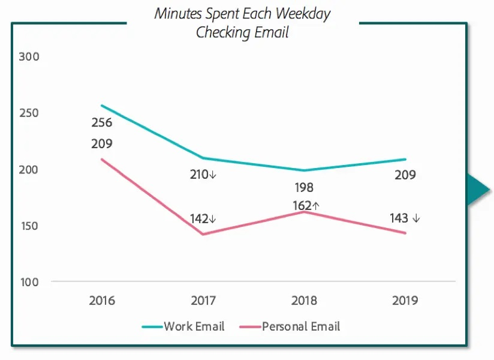

# Project 3: Subreddit Classifier

### Introduction

Emails are a huge part of any job. Whether it be research, corporate or even education, people use this technology to leave messages, some less important than others. Some have argued that emails are to become obsolete in the future, but evidence shows that email is here to stay for the foreseeable future. For example, IMs (instant messengers) might be faster, more wieldy, but there are so many of them out there now that it is difficult to keep track of which contact uses which IM.

Having said that, a [survey by Adobe](https://blog.adobe.com/en/publish/2019/09/08/if-you-think-email-is-dead--think-again.html#gs.f14pa9) have shown that employees spend a large amount of time on emails. The survey shows that the average email consumer spends about 3 hours a day on work email and 2 hours a day on personal email. 5 hours in a 24 hour day spent on email is definitely significant.

Granted, a portion of the time is spent on *reading* emails, but the other portion is spent writing them, and people have called writing emails "stressful" and "exhausting". They fear that writing too short an email reply might convey the wrong message ("thanks" or even "noted with thanks"), and they then ponder about the best way to go about crafting a reply that would not get them on the bad side of the wrong people.

Now just imagine how much more productive employees could be if something was to help them write parts of their email!

### Problem Statement

DBS has found that their employees have spent too much time on emails. They would like to implement some infrastructural aids so that employees can be more productive elsewhere. Email writing aids aren't the most novel idea in the world, with textexpander and Google's in-built Smart Compose features. 

However, the top brass at DBS's cybersecurity department have qualms about using third-party software in their infrastructure for security reasons. As a corporation holding loads of sensitive information and data, even the tiniest of risks could lead to a massive breach and leakage of personal information. 

Thus, the data science team has been tasked with building an email writing aid from scratch in the form of a word autocompleter or a text generator and see if it is ultimately worth implementing in their infrastructure.

### Executive Summary

This project explored data collected from the Enron email dataset, which served as the basis for a text generator based in the finance industry. This data was analyzed, cleaned and then preprocessed for usage in modelling.

We explored a few models in the journey to pick out the best one. First, we implemented a LSTM RNN model, training it with the base unclean data and established it as a base model. Next, we reran the same model but with the cleaned data. After that, we explored a pre-built transformers model (GPT-2) and finally we looked at a Markov Chains model for comparison. Ultimately, the GPT-2 model outperforms the rest, but there were several interesting quirks about the other models.

Finally, an efficiency analysis was conducted to see if the model, if implemented, would bring about a sufficiently significant upside.

### Deployment

The project was deployed on Streamlit at https://share.streamlit.io/jh-mei/ga-dsi-24-projects/Capstone_Project/deploy.py

### Conclusion

If this idea was to be implemented in DBS' infrastructure, GPT-2 would clearly be the way to go, maybe with Markov Chains to help with word autocompletion. 

However, we must also consider the time savings, which was the main issue of the problem statement. GPT-2 texts take around a minute to generate, for an average email-length text of 1000 characters. You also won't necessarily get a good enough email on the first go. 

In comparison, the average person types [200 characters a minute](https://en.wikipedia.org/wiki/Words_per_minute), which means that if the generated text isn't up to standards 5 times in a row, you would have been better off typing the email by yourself. 

Perhaps a more feasible idea would be to edit parts of a generated email manually.

### Further Steps

- Probably the immediate next step would be to try to improve the consistency of the results, be it increasing the temperature parameter which would reduce the randomness of output at a cost of quality, or fiddling more with the learning rate during finetuning. 

- Perhaps working with a larger portion of the Enron corpus would also be progress and should theoretically increase the consistency of writing style. 

- Finally, I could also try a different language model altogether, using a newer (and much larger) model like GPT-J.